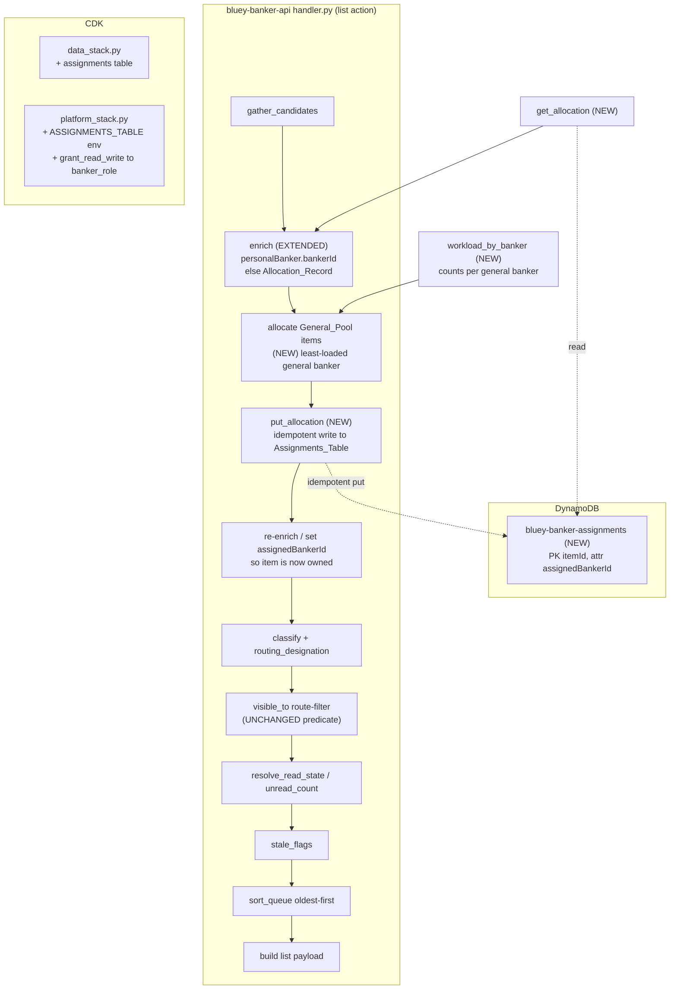
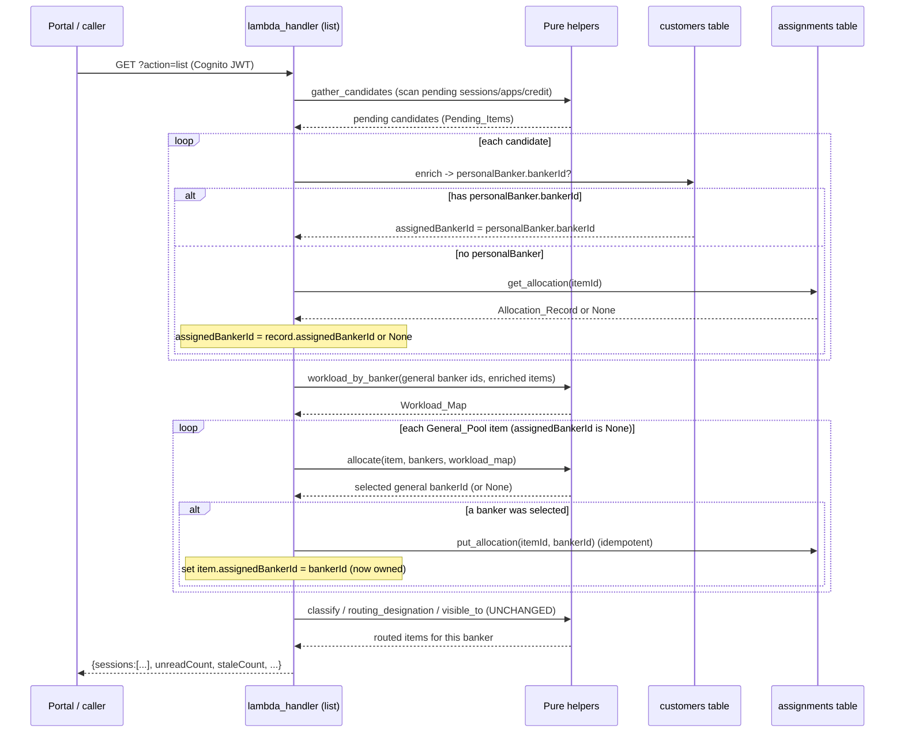

# Design Document: Banker Workload Allocation

## Overview

This feature adds a **workload counter** and a **general-pool allocation
mechanism** to the banker portal backend
(`lambda/bluey-banker-api/handler.py`, seeded by `scripts/seed_data.py`). It is
additive and grounded entirely in the real backend pipeline
(`gather_candidates` → `enrich` → `classify`/`routing_designation` →
`visible_to`), NOT the browser-only `scripts/local_banker_stub.py`, which is
never treated as a source of truth.

Two new capabilities are introduced, following the repository's established
**pure-function + injectable-table** pattern (mirroring `enrich`,
`visible_to`, `stale_flags`, `read_state_for`/`resolve_read_state`,
`mark_read`):

1. **Workload counting** — pure helpers `workload_count(banker_id, items)` and
   `workload_by_banker(banker_ids, items)` that count how many pending
   (`Pending_Item`) queue items are currently assigned to a banker via the
   `assignedBankerId` field already set by `enrich`. These are pure, take
   already-enriched items, do no I/O, and are directly property-testable under
   Hypothesis. (Requirements 1, 2, 7.)

2. **Allocation** — a pure selector `allocate(item, bankers, workload_map)` that
   assigns a `General_Pool` item to the least-loaded `General_Tier` banker
   (ties broken by lowest `bankerId` lexicographically, `Premium_Tier` bankers
   excluded), plus a **new `bluey-banker-assignments` DynamoDB table** keyed by
   `itemId` that persists the chosen allocation as an `Allocation_Record`.
   (Requirements 3, 4, 6, 7, 8.)

The persistence is the only new I/O and is factored behind two injectable
helpers — `get_allocation(item_id, assignments_tbl=None)` (read back an
`Allocation_Record`) and `put_allocation(item_id, banker_id, assignments_tbl=None)`
(idempotent write) — each defaulting to a module-level table so the surrounding
logic stays testable without live AWS. `enrich` is extended so that, when a
customer has no `personalBanker.bankerId`, it reads back any persisted
`Allocation_Record` and sets `assignedBankerId` from it. Because routing keys
solely off `assignedBankerId`, the **`visible_to` predicate is UNCHANGED**: an
allocated item automatically flips from being a `General_Pool` item (visible to
every general banker) to an `Assigned_Item` (visible only to its owner)
(Requirements 5, 6).

**Key semantic decisions:**

- **A queue item counts toward workload only while it is pending.** Resolved
  items (approved/rejected) leave the queue via `gather_candidates` and so are
  never counted (Requirements 1.2, 1.3). Because `gather_candidates` already
  emits only pending records, `workload_count` operates over the
  already-gathered candidate list and treats every gathered item as a
  `Pending_Item`.
- **Allocation makes an item owned work.** Once written, an `Allocation_Record`
  is read back on every subsequent request, so allocation is durable and a
  second general banker never sees or actions the same application
  (Requirements 6.1–6.3).
- **`personalBanker` always wins over allocation.** `enrich` consults an
  `Allocation_Record` only when the customer has no `personalBanker.bankerId`,
  preserving existing assigned-customer routing unchanged (Requirements 5.1,
  5.2, 6.4).
- **Premium bankers are never allocation candidates.** `allocate` considers only
  `tier == "general"` bankers, matching the existing `visible_to` rule that the
  general pool is visible to general-tier bankers only (Requirements 3.3, 6.5).

---

## Architecture



The new logic slots into the existing `list` pipeline between enrichment and the
route-filter. Workload counting is a pure step over the enriched candidate list;
allocation is a pure selection followed by a single idempotent persistence write
per newly allocated item; the read-back in `enrich` closes the loop so an
allocated item is treated as owned work on the next request. Everything except
the two `Assignments_Table` helpers is pure and property-testable.

---

## Sequence Diagram: list request with allocation



---

## Components and Interfaces

### Component 1: `workload_count` (NEW pure helper)

**Purpose**: Count how many pending queue items are assigned to one banker.

**Interface**:
```python
def workload_count(banker_id: str, items: list[dict]) -> int:
    """Number of Pending_Items whose assignedBankerId equals banker_id."""
```

**Responsibilities**:
- Return the number of items `i` in `items` where `i.get("assignedBankerId") == banker_id`
  (Requirement 1.1). A falsy/absent `assignedBankerId` matches no banker, so
  unassigned items are never counted (Requirements 1.1, 8.1).
- Treat every supplied item as a `Pending_Item`: the list is produced by
  `gather_candidates`, which emits only pending records, so resolved
  (approved/rejected) items are already absent (Requirements 1.2, 1.3, 1.4).
- Return an integer in `[0, len(items)]` (Requirement 1.5).
- Be pure and deterministic: no mutation of `items`, no I/O, equal
  `(banker_id, items)` ⇒ equal result (Requirement 1.6).

### Component 2: `workload_by_banker` (NEW pure helper)

**Purpose**: Compute every candidate banker's workload in one pass so the
allocator can pick the least-loaded consistently.

**Interface**:
```python
def workload_by_banker(banker_ids, items: list[dict]) -> dict[str, int]:
    """Map each supplied bankerId to its workload_count over items."""
```

**Responsibilities**:
- Return a mapping with exactly one entry per supplied `bankerId`
  (Requirement 2.1). Duplicate ids collapse to a single key (a mapping cannot
  hold a key twice), which is consistent with "exactly one entry per banker".
- Set each banker's value to `workload_count(banker_id, items)` over the same
  list (Requirement 2.2), which is `0` when the banker has no assigned pending
  items (Requirement 2.3).
- Be pure and deterministic: no mutation of either argument, no I/O, equal
  inputs ⇒ equal result (Requirement 2.4).

### Component 3: `allocate` (NEW pure helper)

**Purpose**: Select the owning `General_Tier` banker for a single
`General_Pool` item.

**Interface**:
```python
def allocate(item: dict, bankers: list[dict], workload_map: dict[str, int]) -> str | None:
    """Return the least-loaded general banker's bankerId (tie: lowest id), or None."""
```

**Responsibilities**:
- If the item already has a truthy `assignedBankerId`, return it unchanged
  (idempotent no-op for already-owned items) (Requirement 3.5).
- Otherwise consider only `General_Tier` bankers (`tier == "general"`) as
  candidates (Requirements 3.3, 6.5).
- Among candidates, return the `Least_Loaded_Banker`: the banker with the
  smallest `workload_map` value, treating a missing entry as `0`
  (Requirements 3.1, 7.1, 8.3).
- Break ties by the smallest `bankerId` compared lexicographically
  (Requirement 3.2).
- Return `None` when there is no general banker (Requirements 3.4, 8.2).
- Be pure and deterministic: no mutation of arguments, no I/O, equal inputs ⇒
  equal result (Requirement 3.6).

**Selection rule (total order over candidates):** a candidate banker is compared
by the key `(workload_map.get(bankerId, 0), bankerId)` and the minimum is
selected. This makes "least loaded, then lexicographically smallest id" a single
deterministic `min(...)`.

### Component 4: `get_allocation` (NEW, injectable I/O helper)

**Purpose**: Read back a persisted `Allocation_Record` for an item.

**Interface**:
```python
def get_allocation(item_id: str, assignments_tbl=None) -> str | None:
    """Return the persisted assignedBankerId for item_id, or None."""
```

**Responsibilities**:
- Look up the `Assignments_Table` by `itemId` (partition key) via `get_item`
  (Requirement 4.2).
- Return the record's `assignedBankerId` when present and truthy, else `None`
  (Requirements 8.4).
- Return `None` (no error) when no record exists for the `itemId`
  (Requirement 8.5).
- Accept the `Assignments_Table` resource as an injectable parameter defaulting
  to the module-level `assignments_table`, so enrichment stays testable without
  live AWS (Requirement 4.4). This `get_item` is the only I/O in the read path.

### Component 5: `put_allocation` (NEW, injectable I/O helper)

**Purpose**: Persist a chosen allocation idempotently.

**Interface**:
```python
def put_allocation(item_id: str, banker_id: str, assignments_tbl=None) -> None:
    """Idempotently persist {itemId, assignedBankerId} unless one already exists."""
```

**Responsibilities**:
- Write an `Allocation_Record` `{"itemId": item_id, "assignedBankerId": banker_id}`
  keyed by `itemId` (Requirements 4.1, 4.2).
- Be idempotent and **not reallocate**: a conditional put
  (`attribute_not_exists(itemId)`) leaves any existing record's
  `assignedBankerId` unchanged; the `ConditionalCheckFailedException` is caught
  and treated as success (Requirements 4.3, 4.5). Writing the same
  `(itemId, assignedBankerId)` more than once leaves the stored record equal to
  a single write (Requirement 4.5).
- Accept the `Assignments_Table` resource as an injectable parameter defaulting
  to the module-level `assignments_table` (Requirement 4.4). This `put_item` is
  the only I/O in the write path.

### Component 6: `enrich` (MODIFIED)

**Purpose**: Resolve an item's `Assigned_Banker`, now honoring persisted
allocations.

**Current behavior (unchanged first branch):** set
`assignedBankerId = personalBanker.bankerId` for a customer that has one
(Requirement 5.1); set `isWalkIn` and `hasLinkedApplication` exactly as today.

**New behavior:** when `_resolve_assigned_banker_id` yields `None` (no
`personalBanker.bankerId` — an `Unassigned_Customer` or `Walk_In_Applicant`),
call `get_allocation(item["itemId"], assignments_tbl)`:
- If it returns a truthy `bankerId`, set `assignedBankerId` to it
  (Requirement 5.2).
- If it returns `None`, leave `assignedBankerId` as `None` (Requirements 5.3,
  8.4, 8.5).

**Interface (extended signature, backward compatible):**
```python
def enrich(item, customers_tbl=None, assignments_tbl=None):
```
Both table resources are injectable and default to the module-level tables, so
`enrich` remains testable without live AWS (Requirements 4.4, 5.4). The only I/O
is the existing customer `get_item` plus, on the unassigned path, one
`Assignments_Table` `get_item`.

### Component 7: `visible_to` (UNCHANGED)

`visible_to` is **not modified**. It reads only `assignedBankerId`:
- truthy ⇒ visible exactly to that banker (an `Assigned_Item`);
- falsy ⇒ visible to `tier == "general"` (the `General_Pool`).

Because allocation sets `assignedBankerId`, an allocated item automatically
routes as an `Assigned_Item` — to the selected banker only, and to no other
general banker (Requirements 6.1–6.4). `routing_designation` (also unchanged)
reports `"assigned"` for such an item.

### Component 8: `list` action wiring (MODIFIED)

**Purpose**: Allocate general-pool items and persist ownership within the
existing pipeline.

**Responsibilities** (inserted after enrichment, before the route-filter):
1. Enrich every candidate (now allocation-aware via Component 6).
2. Build the candidate set of `General_Tier` bankers by scanning
   `bankers_table` (reusing the same table `resolve_banker` uses) and compute
   `workload_map = workload_by_banker(general_ids, candidates)`.
3. For each `General_Pool` candidate (`assignedBankerId` falsy), compute
   `selected = allocate(item, bankers, workload_map)`; when `selected` is not
   `None`, `put_allocation(item["itemId"], selected)` and set
   `item["assignedBankerId"] = selected` so the in-memory item becomes owned
   work for the rest of this request (Requirements 6.1–6.3).
   - Newly allocated items are reflected into `workload_map` as they are
     assigned so a burst of unassigned items in one request still spreads across
     general bankers rather than piling onto the initial least-loaded one
     (Requirement 7.2).
4. Continue unchanged: `classify` + `routing_designation`, `visible_to`
   route-filter, `resolve_read_state`/`unread_count`, `stale_flags`,
   `sort_queue`, payload build.

This leaves approve/reject, read/unread, staleness, ordering, and premium
routing untouched (see "Preservation of existing behavior").

---

## Data Models

### New table: `bluey-banker-assignments` (Assignments_Table)

A dedicated DynamoDB table storing one `Allocation_Record` per queue item.

| Attribute          | Type   | Role                                   |
|--------------------|--------|----------------------------------------|
| `itemId`           | String | **Partition key** — canonical queue-item id (`build_item_id`) |
| `assignedBankerId` | String | The allocated general banker's `bankerId` |

- Partition key `itemId` guarantees **at most one** `Allocation_Record` per
  queue item (Requirement 4.2), matching the canonical ids
  `session#…`, `application#…`, `credit#…#…` produced by `build_item_id`.
- No sort key. `PAY_PER_REQUEST` billing, `RETAIN` removal policy outside `dev`
  (mirroring every other table in `data_stack.py`, e.g. `read_state`).
- No seed data — allocation records are created at runtime by `put_allocation`.
  `scripts/seed_data.py` is not required to seed this table (consistent with the
  script's "tables created without seed data" convention); it MAY be extended
  later but is not needed for the feature.

### Allocation_Record shape

```python
{
    "itemId": str,            # partition key, e.g. "application#APP-DEMO-001"
    "assignedBankerId": str,  # e.g. "banker-001" (a General_Tier banker)
}
```

**Validation rules:**
- `itemId` is the item's canonical `itemId` from the pipeline.
- `assignedBankerId`, when present, is the `bankerId` of a `General_Tier`
  banker (allocation never selects a premium banker — Requirements 3.3, 6.5).
- A record missing `assignedBankerId` is treated as "no persisted allocation":
  `get_allocation` returns `None` and `enrich` leaves `assignedBankerId` as
  `None` (Requirement 8.4).

### Enriched queue item (unchanged shape, allocation-aware `assignedBankerId`)

`enrich` continues to add the same three fields; only the *source* of
`assignedBankerId` is extended:

```python
{
    "itemId": str,
    "source": "session" | "application" | "credit",
    "customerId": str | None,
    "reference": str | None,
    "accountType": str | None,
    "createdAt": str | None,
    "updatedAt": str | None,
    "raw": dict,
    # set by enrich:
    "assignedBankerId": str | None,   # personalBanker.bankerId, ELSE Allocation_Record, ELSE None
    "isWalkIn": bool,
    "hasLinkedApplication": bool,
}
```

**Validation rules:**
- `assignedBankerId` is `personalBanker.bankerId` when the customer has one;
  else the persisted `Allocation_Record.assignedBankerId` when one exists; else
  `None` (Requirements 5.1–5.3).
- After the `list` wiring allocates and sets it, a `General_Pool` item that
  received an allocation has a truthy `assignedBankerId` and is thereafter an
  `Assigned_Item` under the unchanged `visible_to` (Requirement 6.1).

### Banker record (unchanged, read-only)

Allocation reads the seeded `bluey-bankers` records unchanged
(`bankerId`, `name`, `email`, `tier`). Per `scripts/seed_data.py`:
`banker-001`/`banker-002` are `general`, `banker-003` is `premium`, so only
`banker-001` and `banker-002` are ever allocation candidates.

---

## Correctness Properties

*A property is a characteristic or behavior that should hold true across all
valid executions of a system — essentially, a formal statement about what the
system should do. Properties serve as the bridge between human-readable
specifications and machine-verifiable correctness guarantees.*

These properties are phrased over the pure helpers (`workload_count`,
`workload_by_banker`, `allocate`, `enrich`, `visible_to`) and the injectable
persistence helpers (`put_allocation`/`get_allocation`, exercised against an
in-memory / `moto` fake `Assignments_Table`), so they need no live AWS. Each is
implemented by a SINGLE Hypothesis property test running ≥100 iterations, tagged
`Feature: banker-workload-allocation, Property N: ...`. The prework consolidated
the acceptance criteria into these seven non-redundant properties.

### Property 1: Workload count is a correct assigned-pending count

*For any* `banker_id` and *any* list of enriched queue items (with mixed
`source` values, some missing/`None`/empty `assignedBankerId`), `workload_count`
returns exactly the number of items whose `assignedBankerId` equals `banker_id`;
the result is an integer in `[0, len(items)]`, is independent of the source of
each item and of the order of the list (any permutation yields the same count),
and items lacking a truthy `assignedBankerId` are counted for no banker. The
call does not mutate `items`.

**Validates: Requirements 1.1, 1.4, 1.5, 1.6, 7.3, 8.1**

### Property 2: Workload map is consistent with the counter and keyed by the supplied ids

*For any* collection of `bankerId` values (possibly with duplicates) and *any*
list of enriched items, `workload_by_banker` returns a mapping whose key set
equals the set of supplied ids (exactly one entry per distinct banker), and for
every supplied id `b` the mapped value equals `workload_count(b, items)` — in
particular `0` for any banker with no assigned pending items. The call does not
mutate either argument and is deterministic for equal inputs.

**Validates: Requirements 2.1, 2.2, 2.3, 2.4**

### Property 3: Allocation selects the least-loaded general banker deterministically

*For any* `General_Pool` item (no truthy `assignedBankerId`), *any* list of
bankers (mixed `general`/`premium` tiers, possibly none general), and *any*
`workload_map`, `allocate` returns `min(general_bankers, key=lambda b: (workload_map.get(b.bankerId, 0), b.bankerId))`
when at least one general banker exists, and `None` otherwise. Consequently the
selected banker's workload (treating a missing map entry as `0`) is less than or
equal to every other general banker's workload, ties are broken by the smallest
`bankerId` lexicographically, a `Premium_Tier` banker is never selected, and a
banker with a strictly larger workload than an available lower-loaded one is
never chosen. `allocate` does not mutate its arguments and is deterministic.

**Validates: Requirements 3.1, 3.2, 3.3, 3.4, 3.6, 6.5, 7.1, 7.2, 8.2, 8.3**

### Property 4: Allocation is a no-op for an already-owned item

*For any* item that already carries a truthy `assignedBankerId`, and *any*
bankers and `workload_map`, `allocate` returns that existing `assignedBankerId`
unchanged (it neither reallocates nor consults the workload map), without
mutating its arguments.

**Validates: Requirements 3.5, 3.6**

### Property 5: Allocation persistence round-trips and is idempotent / non-reallocating

*For any* `itemId` and `bankerId`, writing the allocation with `put_allocation`
and then reading it with `get_allocation` returns that `bankerId` (round-trip);
writing the same `(itemId, bankerId)` any number of times leaves the stored
`Allocation_Record` equal to a single write (idempotence); once a record exists
for an `itemId`, a subsequent `put_allocation(itemId, other_banker)` leaves the
stored `assignedBankerId` unchanged (no reallocation); and `get_allocation`
returns `None` — without raising — when no record exists for the `itemId`. All
exercised against an injected fake `Assignments_Table`.

**Validates: Requirements 4.1, 4.3, 4.5, 8.5**

### Property 6: Enrich resolves the assigned banker by precedence, robustly

*For any* candidate item, `enrich` sets `assignedBankerId` by this precedence:
the owning customer's `personalBanker.bankerId` if present; else the injected
`Allocation_Record`'s `assignedBankerId` if a record with a truthy value exists
for the item's `itemId`; else `None`. A record missing (or with a falsy)
`assignedBankerId` is treated as no persisted allocation (`assignedBankerId`
stays `None`), and no allocation lookup can override a present
`personalBanker.bankerId`. Exercised with injected fake customers and
assignments tables.

**Validates: Requirements 5.1, 5.2, 5.3, 8.4**

### Property 7: An allocated item is visible only to its owner (unchanged predicate)

*For any* item allocated to a selected general banker (its `assignedBankerId` set
to that banker), the UNCHANGED `visible_to` predicate returns `True` for the
selected banker at any tier, returns `False` for every other general banker at
`tier == "general"`, and `routing_designation` reports `"assigned"`. Moreover,
`visible_to`'s result depends only on `assignedBankerId`, so an item assigned via
allocation and one assigned via `personalBanker` with the same `assignedBankerId`
are indistinguishable to `visible_to` (existing assigned-customer routing is
preserved).

**Validates: Requirements 6.1, 6.2, 6.3, 6.4**

---

## Error Handling

### Scenario 1: Missing or malformed `assignedBankerId` on an item

**Condition**: A queue item has no `assignedBankerId` key, or it is `None`/empty.
**Response**: `workload_count` treats it as unassigned and counts it for no
banker; `allocate` treats it as a `General_Pool` item eligible for allocation
(Requirement 8.1). No error.
**Recovery**: None needed.

### Scenario 2: No general banker available

**Condition**: The banker set contains only `Premium_Tier` bankers, or is empty.
**Response**: `allocate` returns `None`; the `list` wiring performs no
`put_allocation` and leaves the item in the `General_Pool` (Requirements 3.4,
8.2). No error.
**Recovery**: The item remains unallocated and is retried on the next request.

### Scenario 3: Candidate general banker absent from the workload map

**Condition**: A general banker has no entry in `workload_map`.
**Response**: `allocate` treats that banker's workload as `0` via
`workload_map.get(bankerId, 0)`, so the banker is a valid (and likely winning)
candidate (Requirement 8.3). No error.
**Recovery**: None needed.

### Scenario 4: Allocation_Record missing `assignedBankerId`

**Condition**: A stored record for an `itemId` lacks a truthy `assignedBankerId`.
**Response**: `get_allocation` returns `None`; `enrich` leaves `assignedBankerId`
as `None`, treating the item as having no persisted allocation
(Requirement 8.4). No error.
**Recovery**: The item is re-eligible for allocation on the next request.

### Scenario 5: No Allocation_Record for an item

**Condition**: `get_allocation` is called for an `itemId` with no record.
**Response**: `get_item` returns no `Item`; `get_allocation` returns `None`
without raising (Requirement 8.5).
**Recovery**: None needed — the unassigned path in `enrich` handles `None`.

### Scenario 6: Concurrent allocation of the same item (race)

**Condition**: Two concurrent `list` requests both select a banker for the same
newly-unassigned `itemId`.
**Response**: `put_allocation` uses a conditional write
(`attribute_not_exists(itemId)`); the first write wins, the second raises
`ConditionalCheckFailedException`, which is caught and treated as success. The
stored `assignedBankerId` is whichever banker wrote first and is never
overwritten (Requirements 4.3, 4.5). Both requests then read back the same
owner via `enrich` on subsequent calls.
**Recovery**: None needed — the conditional put makes allocation
first-writer-wins and stable.

---

## Testing Strategy

### Unit Testing Approach

- Example tests for `workload_count` on small hand-built lists: a banker with
  several assigned pending items, a banker with none (→ 0), items with missing
  `assignedBankerId` (→ not counted), and mixed sources.
- Example tests for `allocate`: distinct loads (least-loaded wins), an explicit
  tie (lowest `bankerId` wins), premium-with-lower-load never chosen, empty /
  premium-only banker set (→ `None`), and an already-assigned item (→ unchanged).
- Example tests for `enrich` precedence: `personalBanker` present (wins),
  `personalBanker` absent + `Allocation_Record` present (record used),
  neither (→ `None`), and a malformed record (→ `None`).
- Example tests for `put_allocation`/`get_allocation` against a `moto` (or
  in-memory fake) table: write→read round-trip, double-write idempotence, and
  no-reallocation on a differing second write.

### Property-Based Testing Approach

**Property Test Library**: Hypothesis (matching the existing
`tests/test_banker_*_properties.py` suite). The handler module lives in a
hyphenated directory (`bluey-banker-api`) so it is loaded via
`importlib.util.spec_from_file_location`, and AWS region env vars are set before
loading — reuse the exact `_load_handler()` pattern from
`test_banker_classify_properties.py` / `test_banker_ordering_property.py`.

- Implement **Property 1–Property 7**, one Hypothesis property test each, at
  minimum 100 iterations (`@settings(max_examples=...)` ≥ 100, consistent with
  the suite's `max_examples=200`).
- Tag each test with a comment:
  `# Feature: banker-workload-allocation, Property N: <property text>` and a
  docstring `**Validates: Requirements X.Y**`.
- **Strategies**:
  - *Items*: dicts with `itemId` (unique per list), a `source` drawn from
    `{"session", "application", "credit"}` plus junk, and `assignedBankerId`
    drawn from a small banker-id pool, `None`, empty string, or the field
    omitted entirely — so missing/malformed fields (Requirement 8.1) are
    exercised.
  - *Banker sets*: lists of `{bankerId, tier}` with `tier` in
    `{"general", "premium"}`, including premium-only and empty sets
    (Requirements 3.4, 8.2); `bankerId`s from a small pool to force ties
    (Requirement 3.2).
  - *Workload maps*: dicts over a subset of banker ids (so some candidates are
    absent → treated as `0`, Requirement 8.3), with small integer loads to
    force ties and differences > 1 (Requirement 7.2).
  - *Fake tables*: an in-memory dict-backed stand-in (or `moto`) implementing
    `get_item`/`put_item` with the conditional-write semantics, injected via the
    `assignments_tbl` / `customers_tbl` parameters, so Properties 5 and 6 run
    without live AWS.
- For the allocator properties, the test asserts the result equals the
  independently computed `min(general, key=(load, id))` rather than
  re-implementing internal branching, mirroring how the ordering property
  asserts structural invariants.

### Integration Testing Approach

- Extend `tests/test_banker_api_integration.py` (with `moto`-backed tables,
  including the new `bluey-banker-assignments` table) to assert the end-to-end
  `list` flow: an unassigned/walk-in pending item with no `personalBanker` is
  allocated to a general banker, an `Allocation_Record` is written, and on a
  second `list` call the item is routed only to the selected banker (invisible
  to the other general banker) — verifying Requirements 6.1–6.3 through the real
  pipeline. 1–2 examples suffice; this is not property-tested because it
  exercises DynamoDB wiring rather than input-varying logic.

### Infrastructure / Smoke Testing Approach

- A CDK assertion (via `aws_cdk.assertions.Template`) that the synthesized
  `BlueyDataStack` contains a DynamoDB table named
  `bluey-banker-assignments-<stage>` with partition key `itemId`
  (Requirement 4.2), and that the banker Lambda has an `ASSIGNMENTS_TABLE`
  environment variable and read/write permissions on that table. Single
  execution — this is configuration, not input-varying logic.

---

## Infrastructure Changes

### `bluey/infra/stacks/data_stack.py`

Add the new table alongside the existing declarations, reusing the local
`table(...)` helper (same `PAY_PER_REQUEST` billing and stage-based removal
policy as every other table):

```python
self.tables["assignments"] = table("bluey-banker-assignments", "itemId")
```

This produces a table `bluey-banker-assignments-<stage>` with partition key
`itemId` and no sort key (Requirement 4.2).

### `bluey/infra/stacks/platform_stack.py`

1. Grant the banker Lambda role read/write on the new table (next to the
   existing `read_state` grant):

   ```python
   data_stack.tables["assignments"].grant_read_write_data(banker_role)
   ```

2. Pass the table name to the banker Lambda as an environment variable (next to
   the existing `READ_STATE_TABLE` `add_environment` call):

   ```python
   self.banker_fn.add_environment(
       "ASSIGNMENTS_TABLE", data_stack.tables["assignments"].table_name
   )
   ```

### `bluey/lambda/bluey-banker-api/handler.py`

Add the module-level table resource next to the existing table definitions,
reading the same env var (matching the established pattern):

```python
assignments_table = dynamodb.Table(
    os.environ.get("ASSIGNMENTS_TABLE", "bluey-banker-assignments")
)
```

No IAM/table changes are made to `bluey-customers`, `bluey-bankers`, or the
queue-source tables. `read`/`write` scope is the minimum needed:
`get_item` + conditional `put_item` on the new table only.

---

## Preservation of Existing Behavior

This feature is strictly additive. The following existing behaviors are
preserved unchanged:

- **`visible_to` (routing predicate)** — the function body is NOT modified. It
  keys solely off `assignedBankerId`, so allocation reuses it verbatim: an
  allocated item becomes an `Assigned_Item` purely because its
  `assignedBankerId` is now set (Requirements 6.1–6.4). Premium bankers continue
  to see only their own assigned items (Requirement 6.5).
- **`personalBanker`-derived assignment** — `enrich` still sets
  `assignedBankerId = personalBanker.bankerId` first and consults an
  `Allocation_Record` only when that is absent, so assigned-customer routing is
  identical to today (Requirements 5.1, 6.4).
- **Approve / reject** — the `approve`/`reject` action is untouched. Resolved
  items leave the pending queue via `gather_candidates`, so they drop out of
  both the queue and every banker's workload count without any special handling
  (Requirements 1.2, 1.3). Allocation never writes to the session/application/
  credit tables.
- **Read / unread state** — `read_state_for`, `resolve_read_state`, and
  `unread_count` are unchanged; the new `Assignments_Table` is separate from
  `bluey-banker-read-state`. `assignedBankerId` is orthogonal to `readState`.
- **Staleness** — `stale_age`/`is_stale`/`stale_flags` are unchanged and depend
  only on `createdAt`/`updatedAt`; allocation does not touch timestamps.
- **Ordering** — `sort_key`/`sort_queue` are unchanged; allocation runs before
  sorting and does not alter timestamps or `reference`, so oldest-first ordering
  is unaffected.
- **`classify` / `routing_designation`** — unchanged. `routing_designation`
  reports `"assigned"` for an allocated item simply because `assignedBankerId`
  is now truthy.
- **`mark_read` authorization** — unchanged; it reuses `visible_to` via
  `routed_item_ids_for`, so once an item is allocated only its owner is
  authorized to mark it read, consistent with visibility.

---

## Dependencies

- Existing pure helpers `enrich`, `visible_to`, `routing_designation`,
  `gather_candidates` (reused; only `enrich` is extended, `visible_to`
  unchanged).
- `boto3` DynamoDB resource (already used) for the new module-level
  `assignments_table` and the two injectable helpers.
- AWS CDK constructs already imported in `data_stack.py` / `platform_stack.py`
  (`aws_dynamodb`, `aws_iam`) — no new construct libraries.
- Hypothesis + pytest (existing dev dependencies) for property tests; `moto`
  (already used by `tests/test_banker_api_integration.py`) for the assignments
  table in integration and persistence tests.
- No new third-party packages, endpoints, or Cognito changes.
