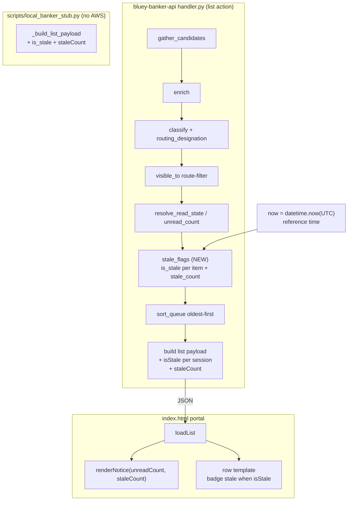

# Design Document: Stale Query Notification

## Overview

This feature adds an in-app notification when a pending queue item has gone
unreviewed for more than 24 hours. It extends the existing
`banker-query-triage` feature (the `list` action in
`lambda/bluey-banker-api/handler.py` and the portal in `index.html`) rather than
introducing new infrastructure: no new tables, no new endpoints, no new AWS
resources.

The backend derives a **per-item stale flag** and an aggregate **stale count**
alongside the existing `unreadCount`, using a new PURE helper `stale_age` /
`is_stale` that mirrors the existing pure-function style (`sort_key`,
`unread_count`) — it takes a reference "now" so it is deterministic and directly
property-testable under Hypothesis. Staleness is computed from the same
`Waiting_Time` the ordering already uses (`createdAt`, falling back to
`updatedAt`), reusing the existing tolerant `_parse_timestamp`. The portal
surfaces staleness two ways: an aggregate banner alongside the existing unread
banner, and a per-row "stale" badge — validated by structural tests in
`tests/test_banker_portal_frontend.py` since there is no JS toolchain. The
local `scripts/local_banker_stub.py` is updated so the feature is exercisable in
the browser without AWS.

Key semantic decision (see "Edge cases and semantics"): **"reviewed" means the
item has left the pending queue** (approved/rejected). A stale item is one that
is *still pending* and older than the threshold. Per-banker `read` state is
tracked independently and does NOT clear staleness — a banker opening/marking an
item read has looked at it but not actioned it, so it can still be flagged
stale. This keeps "stale" orthogonal to "unread" and avoids hiding genuinely
un-actioned old work.

---

## Architecture



The staleness computation is a new pure step inserted into the existing `list`
pipeline. It reads only fields already present on each candidate
(`createdAt`, `updatedAt`) plus an injected reference `now`; it does no I/O and
does not depend on read state or routing, so it composes cleanly with the
existing steps and is independently testable.

---

## Sequence Diagram: list request with staleness

```mermaid
sequenceDiagram
    participant P as Portal (index.html)
    participant H as lambda_handler (list)
    participant PF as Pure helpers
    participant DDB as DynamoDB tables

    P->>H: GET ?action=list (Cognito JWT)
    H->>DDB: gather_candidates (scan sessions/apps/credit)
    DDB-->>H: raw pending records
    H->>DDB: enrich (customer lookup) + read_state_for
    DDB-->>H: assignedBankerId, read ids
    H->>PF: classify / visible_to / resolve_read_state
    PF-->>H: routed + read-resolved items
    Note over H: now = datetime.now(UTC)
    H->>PF: stale_flags(items, now, threshold=24h)
    PF-->>H: each item.isStale + staleCount
    H->>PF: sort_queue (oldest-first)
    PF-->>H: ordered items
    H-->>P: {unreadCount, staleCount, sessions:[{..., isStale}], ...}
    P->>P: renderNotice(unreadCount, staleCount)
    P->>P: render rows; add "badge stale" where isStale
```

---

## Components and Interfaces

### Component 1: `stale_age` (NEW pure helper)

**Purpose**: Compute how long an item has been waiting, relative to a reference
`now`, as a `timedelta` — or `None` when the item is undated. This is the single
source of truth for "age", built on the existing `Waiting_Time` derivation.

**Interface**:
```python
def stale_age(item: dict, now: datetime) -> timedelta | None:
    """Age of a queue item at reference time `now`, or None if undated."""
```

**Responsibilities**:
- Derive `Waiting_Time` exactly as `sort_key` does: parse `createdAt`, falling
  back to `updatedAt`, via the existing `_parse_timestamp`.
- Return `now - waiting_time` when a timestamp is parseable, else `None`
  (undated).
- Perform no I/O; be deterministic given `(item, now)`.

### Component 2: `is_stale` (NEW pure helper)

**Purpose**: The boolean staleness predicate for a single item.

**Interface**:
```python
STALE_THRESHOLD = timedelta(hours=24)

def is_stale(item: dict, now: datetime, threshold: timedelta = STALE_THRESHOLD) -> bool:
    """True when a dated item's age strictly exceeds `threshold` (default 24h)."""
```

**Responsibilities**:
- Return `True` iff `stale_age(item, now)` is not `None` AND strictly greater
  than `threshold`.
- Return `False` for undated items (`stale_age is None`) and for items at or
  below the threshold.
- Perform no I/O; be deterministic; be total over all `item` dicts.

### Component 3: `stale_flags` (NEW pure helper)

**Purpose**: Join staleness onto each item and produce the aggregate count, in
one pass — mirroring `resolve_read_state` + `unread_count`.

**Interface**:
```python
def stale_flags(
    items: list[dict],
    now: datetime,
    threshold: timedelta = STALE_THRESHOLD,
) -> int:
    """Set item["isStale"] for each item and return the count of stale items."""
```

**Responsibilities**:
- For each item, set `item["isStale"] = is_stale(item, now, threshold)`.
- Return the number of items whose `isStale` is `True`.
- Perform no I/O; be deterministic; the returned count MUST equal
  `sum(1 for i in items if i["isStale"])` by construction.

### Component 4: `list` action wiring (MODIFIED)

**Purpose**: Insert the staleness step into the existing pipeline and surface it
in the payload.

**Responsibilities**:
- Capture `now = datetime.now(timezone.utc)` once per request (single reference
  time so all items are judged against the same instant).
- Call `stale_flags(filtered, now)` after read-state resolution and before/at
  the same point as sorting (order relative to sort is irrelevant — staleness
  does not affect `sort_key`).
- Add `isStale` to each serialized session object and `staleCount` to the
  top-level payload, alongside the existing `unreadCount`.
- Not alter existing ordering (R2.4 remains intact) or existing fields.

### Component 5: Portal `renderNotice` + row template (MODIFIED, `index.html`)

**Purpose**: Show the stale notification.

**Responsibilities**:
- `renderNotice(unreadCount, staleCount)` renders the existing unread banner and
  ADDS a stale message/segment when `staleCount > 0` (e.g. "N item(s) waiting
  over 24 hours"). When `staleCount === 0` it shows no stale warning.
- The row template adds a `badge stale` (analogous to `badge category`) when the
  session's `isStale` is truthy, giving per-row visibility.
- Rows still render in server order without re-sorting (R2.4 unchanged).

### Component 6: Local stub (MODIFIED, `scripts/local_banker_stub.py`)

**Purpose**: Keep the feature testable in the browser with no AWS.

**Responsibilities**:
- Compute `isStale` per seeded item and a `staleCount` in `_build_list_payload`,
  using a 24h threshold against `datetime.now(UTC)` and the same
  `createdAt`/`updatedAt` fallback.
- Seed at least one item older than 24h so the banner and badge are visible
  (the existing seed dates are in 2026, i.e. future-relative-to-now handling
  must be considered — the stub should seed a clearly-past `createdAt`).

---

## Data Models

### Modified: list payload (top-level)

```python
{
    "bankerId": str,
    "tier": str,
    "unreadCount": int,      # existing
    "staleCount": int,       # NEW — number of stale (pending > 24h) routed items
    "sessions": [ <session object>, ... ],
    "applications": [ ... ],
}
```

**Validation Rules**:
- `staleCount >= 0`.
- `staleCount == sum(1 for s in sessions if s["isStale"])` (consistency with the
  per-row flags).
- `staleCount <= len(sessions)`.

### Modified: session object (per row)

```python
{
    "itemId": str,
    "sessionId": str | None,
    "reference": str | None,
    "customerId": str | None,
    "fullName": str,
    "accountType": str | None,
    "workCategory": str,
    "routing": str,
    "status": str,
    "readState": "read" | "unread",   # existing
    "isStale": bool,                  # NEW — dated AND age > 24h
    "createdAt": str | None,
    "updatedAt": str | None,
}
```

**Validation Rules**:
- `isStale` is always a `bool` (never absent, never null).
- `isStale` is `False` whenever both `createdAt` and `updatedAt` are
  missing/unparseable (undated ⇒ not stale).
- `isStale` is independent of `readState` (a read item may still be stale).

---

## Key Functions with Formal Specifications

### Function 1: `stale_age(item, now)`

```python
def stale_age(item: dict, now: datetime) -> timedelta | None
```

**Preconditions:**
- `item` is a dict (may lack timestamp fields).
- `now` is a timezone-aware `datetime`.

**Postconditions:**
- If neither `createdAt` nor `updatedAt` parse (`_parse_timestamp` ⇒ `None` for
  both), returns `None`.
- Otherwise returns `now - w`, where `w` is the parsed `createdAt` if present
  and parseable, else the parsed `updatedAt`.
- Pure: no mutation of `item`, no I/O.
- Deterministic: equal `(item, now)` ⇒ equal result.

**Loop Invariants:** N/A (no loops).

### Function 2: `is_stale(item, now, threshold=STALE_THRESHOLD)`

```python
def is_stale(item: dict, now: datetime, threshold: timedelta = STALE_THRESHOLD) -> bool
```

**Preconditions:**
- `item` is a dict; `now` is tz-aware; `threshold` is a non-negative
  `timedelta`.

**Postconditions:**
- Returns a `bool`.
- Returns `True` iff `stale_age(item, now)` is not `None` AND
  `stale_age(item, now) > threshold` (STRICT: age exactly equal to the threshold
  is NOT stale).
- Returns `False` for undated items and for any item with a future or
  within-threshold `Waiting_Time`.
- Pure; deterministic; total over all dicts.

**Loop Invariants:** N/A.

### Function 3: `stale_flags(items, now, threshold=STALE_THRESHOLD)`

```python
def stale_flags(items: list[dict], now: datetime, threshold: timedelta = STALE_THRESHOLD) -> int
```

**Preconditions:**
- `items` is a list of dicts; `now` is tz-aware.

**Postconditions:**
- After the call, every `item` in `items` has `item["isStale"] == is_stale(item, now, threshold)`.
- Returns `count` where `count == sum(1 for i in items if i["isStale"])`.
- `0 <= count <= len(items)`.
- Mutates only the `isStale` key of each item; no I/O.

**Loop Invariants:**
- Before processing index `k`, `isStale` has been set correctly on items
  `0..k-1`, and `running_count` equals the number of stale items among
  `0..k-1`.

---

## Algorithmic Pseudocode

### Staleness determination and aggregation

```pascal
ALGORITHM stale_flags(items, now, threshold)
INPUT: items (list of queue-item dicts), now (tz-aware datetime),
       threshold (timedelta, default 24 hours)
OUTPUT: count (integer number of stale items)

BEGIN
  count ← 0

  FOR each item IN items DO
    ASSERT running_count_matches_processed_prefix(items, count)

    age ← stale_age(item, now)          // None when undated

    IF age IS NOT NULL AND age > threshold THEN
      item.isStale ← TRUE
      count ← count + 1
    ELSE
      item.isStale ← FALSE
    END IF
  END FOR

  ASSERT count = COUNT(i IN items WHERE i.isStale = TRUE)
  RETURN count
END


ALGORITHM stale_age(item, now)
INPUT: item, now
OUTPUT: age (timedelta) OR NULL

BEGIN
  w ← parse_timestamp(item.createdAt)     // reuse existing _parse_timestamp
  IF w IS NULL THEN
    w ← parse_timestamp(item.updatedAt)   // Waiting_Time fallback (as sort_key)
  END IF

  IF w IS NULL THEN
    RETURN NULL                            // undated ⇒ never stale
  END IF

  RETURN now - w
END
```

**Preconditions:** `items` well-formed list; `now` tz-aware.
**Postconditions:** each item flagged; `count` consistent with flags.
**Loop Invariants:** `count` equals the number of stale items in the processed
prefix at each iteration.

---

## Example Usage

```python
from datetime import datetime, timezone, timedelta

now = datetime(2026, 8, 27, 12, 0, 0, tzinfo=timezone.utc)

items = [
    {"itemId": "a", "createdAt": "2026-08-25T12:00:00+00:00"},  # 48h old -> stale
    {"itemId": "b", "createdAt": "2026-08-27T00:00:00+00:00"},  # 12h old -> not stale
    {"itemId": "c", "createdAt": None, "updatedAt": None},      # undated -> not stale
    {"itemId": "d", "updatedAt": "2026-08-25T12:00:00+00:00"},  # fallback, stale
]

count = stale_flags(items, now)         # -> 2
assert items[0]["isStale"] is True
assert items[1]["isStale"] is False
assert items[2]["isStale"] is False
assert items[3]["isStale"] is True
assert count == sum(1 for i in items if i["isStale"])

# Single-item predicate (deterministic given now):
assert is_stale(items[0], now) is True
assert is_stale(items[2], now) is False

# Boundary: exactly 24h is NOT stale (strict >).
edge = {"createdAt": (now - timedelta(hours=24)).isoformat()}
assert is_stale(edge, now) is False
```

Wiring into the `list` action:

```python
# ... after resolve_read_state(filtered, read_ids)
now = datetime.now(timezone.utc)
stale = stale_flags(filtered, now)      # sets isStale on each item
ordered = sort_queue(filtered)          # ordering unaffected by isStale
# ... per session object: "isStale": c.get("isStale", False)
# ... payload: "staleCount": stale
```

---

## Correctness Properties

These are the properties for property-based testing (Hypothesis), phrased over
the pure helpers so they need no AWS.

- **P1 — Threshold monotonicity / strictness.** For all items `i` and reference
  `now`: `is_stale(i, now)` is `True` iff the item is dated and its age is
  strictly greater than 24h. Equivalently, an item whose sole timestamp is
  `now - 24h` is NOT stale, and one at `now - 24h - ε` IS stale.
  `∀ i, now: is_stale(i, now) ⇔ (stale_age(i, now) ≠ None ∧ stale_age(i, now) > 24h)`

  **Validates: Requirements 2.1, 2.2, 2.3, 2.5, 2.6, 9.2**

- **P2 — Undated items are never stale.** For all items with no parseable
  `createdAt` and no parseable `updatedAt`, `is_stale` is `False` for every
  `now`. `∀ i (undated), now: is_stale(i, now) = False`.

  **Validates: Requirements 1.3, 2.4, 9.1**

- **P3 — Count consistency.** After `stale_flags(items, now)` returns `count`:
  `count = |{ i ∈ items : i.isStale = True }|` and
  `0 ≤ count ≤ len(items)`. Each item's `isStale` equals `is_stale(item, now)`.

  **Validates: Requirements 3.1, 3.2, 3.3, 6.4**

- **P4 — Read/stale independence.** `is_stale` depends only on
  `createdAt`/`updatedAt`/`now`, not on `readState`; mutating `readState` on an
  item does not change its `isStale` result.
  `∀ i, now: is_stale(i, now) = is_stale(i with readState toggled, now)`.

  **Validates: Requirements 4.1, 4.2**

- **P5 — Waiting_Time consistency with ordering.** Staleness uses the same
  timestamp `sort_key` uses. For any two dated items, if `i` is older than `j`
  (`sort_key(i) < sort_key(j)` on the timestamp component) then
  `stale_age(i, now) ≥ stale_age(j, now)`; monotonic threshold ⇒ if `j` is stale
  then `i` is stale.

  **Validates: Requirements 1.2, 1.4, 5.1, 5.2, 5.3**

- **P6 — Determinism / purity.** `stale_age` and `is_stale` return equal results
  for equal `(item, now)` inputs across repeated calls, and do not mutate their
  `item` argument. `stale_flags` mutates only the `isStale` key.

  **Validates: Requirements 1.1, 1.5, 2.7, 3.4**

- **P7 (frontend, structural).** `renderNotice` accepts `staleCount` and emits a
  "over 24 hours" style message only when `staleCount > 0`; the row template
  emits a `badge stale` bound to the session's `isStale`; rows still render via
  `sessions.map(` with no client-side `.sort(`.

  **Validates: Requirements 7.1, 7.2, 7.3, 7.4**

---

## Error Handling

### Scenario 1: Unparseable or missing timestamps

**Condition**: `createdAt` and `updatedAt` are absent, empty, or not ISO-8601.
**Response**: `_parse_timestamp` returns `None` for both; `stale_age` returns
`None`; `is_stale` returns `False` (item treated as UNDATED, consistent with
ordering).
**Recovery**: None needed — the item simply is not flagged stale and no error
propagates.

### Scenario 2: Future-dated `Waiting_Time`

**Condition**: A record's timestamp is after `now` (clock skew / seeded future
dates). `stale_age` is negative.
**Response**: `is_stale` returns `False` (negative age is not `> threshold`). No
error.
**Recovery**: None; the item ages into staleness naturally as time passes.

### Scenario 3: Naive (tz-less) timestamps

**Condition**: A stored timestamp lacks a timezone.
**Response**: `_parse_timestamp` already assumes UTC for naive datetimes, so
comparison against the tz-aware `now` never raises a mixed aware/naive
`TypeError`.
**Recovery**: None; handled by the existing parser.

---

## Testing Strategy

### Unit Testing Approach

- Direct example tests for `stale_age` and `is_stale` covering: clearly-old
  (48h) items, fresh items, the exact 24h boundary (not stale), just-past
  boundary (stale), the `createdAt`→`updatedAt` fallback, undated items, and
  future-dated items.
- An example test for `stale_flags` asserting per-item `isStale` assignment and
  the returned count on a mixed list.

### Property-Based Testing Approach

**Property Test Library**: Hypothesis (matching the existing
`test_banker_*_properties.py` suite, loaded via
`importlib.util.spec_from_file_location` because the module dir is hyphenated).

- Encode **P1–P6** above. Strategies generate `now` and item dicts with
  `createdAt`/`updatedAt` drawn as tz-aware datetimes offset around `now`
  (including exactly-threshold and future offsets), plus undated variants
  (`None`/empty/garbage strings). Reuse the loader/env-var setup pattern from
  `tests/test_banker_read_state_properties.py`.

### Frontend / Structural Testing Approach

- Extend `tests/test_banker_portal_frontend.py` (same `html.parser` + `re`
  approach, no JS runtime) with tests for **P7**: `renderNotice` signature/body
  mentions the stale/"24 hour" wording gated on `staleCount > 0`; row template
  contains a `badge stale` bound to `isStale`; existing no-`.sort()` and
  server-order assertions still hold.

### Integration Testing Approach

- Optionally extend `tests/test_banker_api_integration.py` to assert the `list`
  payload includes `staleCount` and that each session object carries `isStale`,
  and that `staleCount` equals the number of stale sessions.

---

## Performance Considerations

Staleness is an O(n) single pass over the already-gathered, already-filtered
items using only in-memory field reads and one `datetime` subtraction per item.
It reuses the existing `_parse_timestamp` (already invoked by ordering), adds no
DynamoDB calls, and does not change the request's I/O profile. Negligible added
cost.

---

## Security Considerations

No change to the security posture. Staleness is computed only over items already
route-filtered by `visible_to`, so a banker's `staleCount`/`isStale` reflect
only items they are authorized to see. No new fields expose customer PII beyond
what the existing list payload already returns. No new endpoints, permissions,
or tables are introduced.

---

## Dependencies

- Python standard library `datetime` (`timedelta`, `timezone`) — already
  imported in `handler.py`.
- Existing pure helper `_parse_timestamp` (reused unchanged).
- Hypothesis + pytest (existing dev dependencies) for property tests.
- No new AWS resources, IAM permissions, tables, or third-party packages.
```
